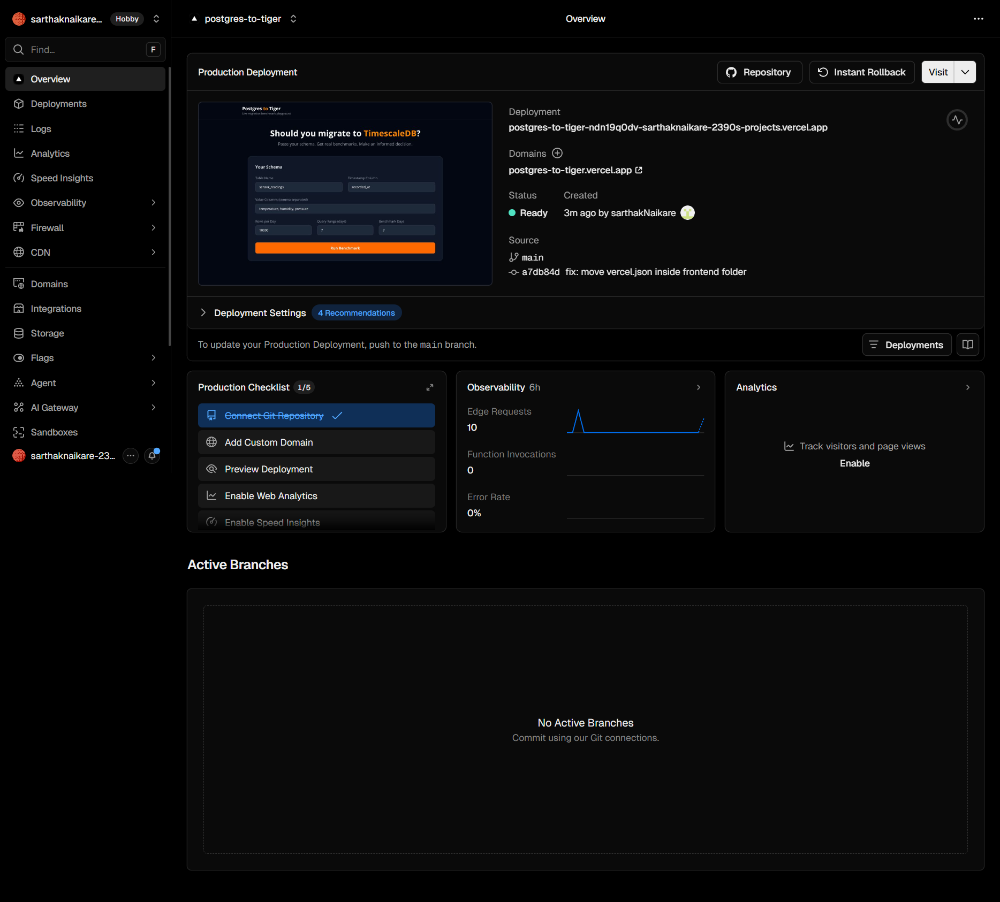
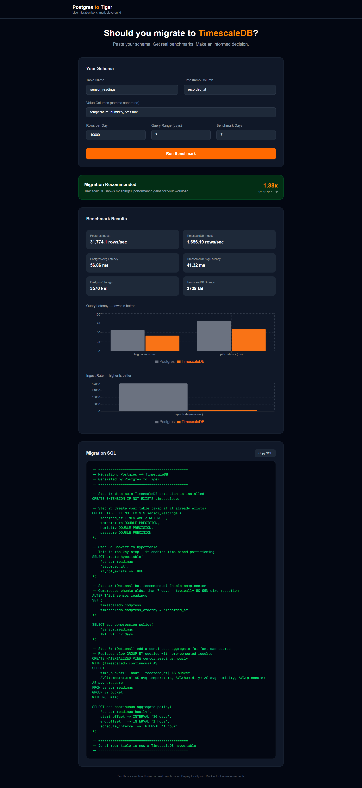

<div align="center">

# 🐯 Postgres → Tiger

### *Should you migrate to TimescaleDB? Let the data decide.*

[](https://postgres-to-tiger.vercel.app)
[](https://postgres-to-tiger-production.up.railway.app/docs)
[](https://github.com/sarthakNaikare/postgres-to-tiger)

**Paste your Postgres schema → Get real benchmarks → Receive migration SQL → In under 60 seconds.**

</div>

---

## ✨ What is this?

An interactive migration playground for developers who want **honest answers** before migrating to TimescaleDB.

No marketing. No guesswork. Just your schema, your data volume, your query patterns — benchmarked side by side on real databases running in ephemeral Docker containers.

> 💡 **When migration isn't worth it yet, the tool says so.** That's the point.

---

## 🎬 Demo





---

## 📊 What it measures

| Metric | Postgres | TimescaleDB | Notes |
|--------|----------|-------------|-------|
| 🚀 **Ingest Rate** | rows/sec | rows/sec | How fast each DB absorbs writes |
| ⚡ **Avg Latency** | ms | ms | Typical time-range query speed |
| 📈 **p95 Latency** | ms | ms | Worst-case query performance |
| 💾 **Storage Size** | kB | kB | Disk cost at your data volume |

---

## 🏗️ Architecture
┌─────────────────────────────────────────┐
│           🌐 User Browser               │
│     Next.js · Tailwind · Recharts       │
│   postgres-to-tiger.vercel.app          │
└──────────────────┬──────────────────────┘
│ POST /benchmark
▼
┌─────────────────────────────────────────┐
│          ⚡ FastAPI Backend             │
│    postgres-to-tiger.up.railway.app     │
│                                         │
│  📝 Workload Gen → 🏃 Benchmark Runner  │
│  🐳 Container Mgr → 📜 SQL Generator   │
└────────────┬──────────────┬─────────────┘
▼              ▼
┌──────────────┐  ┌──────────────────┐
│ 🐘 Postgres  │  │ 🐯 TimescaleDB   │
│  (ephemeral) │  │   (ephemeral)    │
└──────────────┘  └──────────────────┘
---

## 🧠 Honest Results

This tool **doesn't always recommend migration** — and that's what makes it trustworthy.
✅ Migration Recommended     →  TimescaleDB wins on query latency at your scale
⚖️  Not Recommended Yet      →  Postgres performs comparably, migrate when data grows
At small volumes (< 50k rows), vanilla Postgres often wins on ingest speed.
TimescaleDB's partitioning overhead only pays off at scale.
The tool tells you **exactly where the crossover point is** for your specific schema.

---

## 🛠️ Tech Stack

| Layer | Technology | Purpose |
|-------|-----------|---------|
| 🎨 **Frontend** | Next.js 16, Tailwind CSS, Recharts | UI, charts, form |
| ⚡ **Backend** | FastAPI, Python 3.12 | API, orchestration |
| 🐘 **Database A** | Postgres 16 | Benchmark baseline |
| 🐯 **Database B** | TimescaleDB 2.x | Benchmark challenger |
| 🐳 **Containers** | Docker | Ephemeral per session |
| ☁️ **Deploy** | Vercel + Railway | Zero cost hosting |

---

## 🚀 Local Development

### Backend
```bash
cd backend
python3 -m venv venv
source venv/bin/activate
pip install -r requirements.txt
uvicorn main:app --reload
# API running at http://localhost:8000
# Docs at http://localhost:8000/docs
```

### Frontend
```bash
cd frontend
npm install
npm run dev
# App running at http://localhost:3000
```

Create `frontend/.env.local`:
NEXT_PUBLIC_API_URL=http://localhost:8000
---

## 📁 Project Structure
postgres-to-tiger/
├── 🐍 backend/
│   ├── main.py                    # FastAPI entry point
│   ├── routers/
│   │   ├── benchmark.py           # POST /benchmark
│   │   ├── health.py              # GET /health
│   │   └── status.py              # GET /status/{id}
│   ├── services/
│   │   ├── container_manager.py   # 🐳 Ephemeral Docker pairs
│   │   ├── workload_generator.py  # 📝 INSERT/SELECT workload
│   │   ├── benchmark_runner.py    # 📊 Performance measurement
│   │   ├── mock_benchmark.py      # 🎭 Demo mode
│   │   └── sql_generator.py       # 📜 Migration SQL
│   └── models/schemas.py          # ✅ Pydantic validation
│
├── ⚛️  frontend/
│   ├── app/page.tsx               # Main page
│   ├── components/
│   │   ├── BenchmarkChart.tsx     # 📊 Recharts visualization
│   │   └── MigrationSQL.tsx       # 📋 Copyable SQL panel
│   └── lib/api.ts                 # 🔌 Backend API client
│
└── 🏗️  infra/
├── caddy/Caddyfile            # Reverse proxy
└── setup_oracle.sh            # Server provisioning

---

## 🔗 Tiger Data Portfolio

> This is Project 4 in my application series for the **Database Support Engineer** role at Tiger Data.

| # | Project | Stack | Focus |
|---|---------|-------|-------|
| 1 | [⭐ Stellar Observatory](https://github.com/sarthakNaikare/stellar-observatory-timescaledb) | TimescaleDB · Kafka · Grafana | NASA SDSS 100K observations |
| 2 | [🎵 Resonance](https://github.com/sarthakNaikare/resonance) | TimescaleDB · React Three Fiber | 5 live streams · 3D visualization |
| 3 | [🔥 Prometheus Unbound](https://github.com/sarthakNaikare/prometheus-unbound) | TimescaleDB · Ghostgres · AI | Self-healing metrics platform |
| 4 | [🐯 Postgres to Tiger](https://github.com/sarthakNaikare/postgres-to-tiger) | FastAPI · Next.js · Docker | **Migration benchmark playground** |

---

<div align="center">

Built with 🧡 by [Sarthak Naikare](https://github.com/sarthakNaikare)

*Targeting the Database Support Engineer — Weekend (India) role at Tiger Data*

</div>
